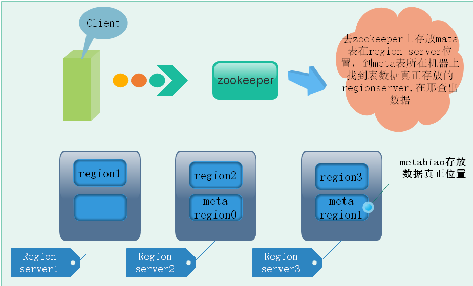

###Hbase

* Hbase 安装：  


1.上传hbase安装包

2.解压

3.配置hbase集群，要修改3个文件（首先zk集群已经安装好了）注意：要把hadoop的hdfs-site.xml和core-site.xml 放到hbase/conf下
	
3.1修改hbase-env.sh
```
	export JAVA_HOME=/usr/java/jdk1.7.0_55
	//告诉hbase使用外部的zk
	export HBASE_MANAGES_ZK=false
	
	3.2 修改hbase-site.xml
	vim hbase-site.xml
	<configuration>
		<!-- 指定hbase在HDFS上存储的路径 -->
        <property>
                <name>hbase.rootdir</name>
                <value>hdfs://hdp20-01:9000/hbase</value>
        </property>
		<!-- 指定hbase是分布式的 -->
        <property>
                <name>hbase.cluster.distributed</name>
                <value>true</value>
        </property>
		<!-- 指定zk的地址，多个用“,”分割 -->
        <property>
                <name>hbase.zookeeper.quorum</name>
                <value>hdp20-01:2181,hdp20-02:2181,hdp20-03:2181</value>
        </property>
	</configuration>
	
	vim regionservers
		hdp20-01
		hdp20-02
		hdp20-03
		hdp20-04
```


3.2拷贝hbase到其他节点
```
		scp -r /weekend/hbase-0.96.2-hadoop2/ weekend02:/weekend/
		scp -r /weekend/hbase-0.96.2-hadoop2/ weekend03:/weekend/
		scp -r /weekend/hbase-0.96.2-hadoop2/ weekend04:/weekend/
		scp -r /weekend/hbase-0.96.2-hadoop2/ weekend05:/weekend/
		scp -r /weekend/hbase-0.96.2-hadoop2/ weekend06:/weekend/
```
		
4.将配置好的HBase拷贝到每一个节点并同步时间。  
date -s '2019-08-08 15:04:30'  
hwclock -w

5.启动所有的hbase  
	首先启动HDFS----查看hdfs集群的状态命令： hdfs dfsadmin -report   ## 不能处于safe mode状态  
	分别启动zk    ./zkServer.sh start,检查保证zk工作状态正常：  检查状态的命令： bin/zkServer.sh status  
	启动hbase集群：利用hbase开发的启动脚本来启动，脚本命令在哪运行，就在哪启动一个master，regionservers文件决定去哪启动region server  
	启动hbase，在主节点上运行：  
		start-hbase.sh  
		
6.通过浏览器访问hbase管理页面  
	192.168.9.11:60010
	
	
7.为保证集群的可靠性，要启动多个HMaster  
	hbase-daemon.sh start master
	

* hbase 特性：

1. HBASE是一个数据库----可以提供数据的实时随机读写   
2. Hbase的表没有固定的字段定义   
3. Hbase的表中每行存储的都是一些key-value对  
4. Hbase的表中有列族的划分，用户可以指定将哪些kv插入哪个列族  
5. Hbase的表在物理存储上，是按照列族来分割的，不同列族的数据一定存储在不同的文  
6. Hbase的表数据存储在HDFS文件系统中,从而，hbase具备如下特性：存储容量可以线性扩展； 数据存储的安全性可靠性极高！  

* hbase 安装及使用：  
1. HBASE是一个分布式系统，其中有一个管理角色：  HMaster(一般2台，一台active，一台backup)，其他的数据节点角色：  HRegionServer(很多台，看数据容量)  
2. 通过bin/start-hbase.sh启动，启动完后，还可以在集群中找任意一台机器启动一个备用的master  
3. Hbase> list     // 查看表  
Hbase> status   // 查看集群状态  
Hbase> version  // 查看集群版本  


* hbase javaAPI操作：

```java
public class T1 {
	public static void main(String[] args) throws Exception {
		createTable();
		delete();
		modify();
		add();
		cutout();
		query();
		scan();
	}
	public static void createTable() throws Exception {
		//创建hbase的conf属性
	Configuration conf = HBaseConfiguration.create();
	//设置hbase集群地址
	conf.set("hbase.zookeeper.quorum", "node1:2181,slave1:2181,slave2:2181");
	Connection conn = ConnectionFactory.createConnection(conf);
	//得到使用权
	Admin admin = conn.getAdmin();
	//创建表的行名user-info
	HTableDescriptor ht = new HTableDescriptor(TableName.valueOf("user-info"));
	//创建表的列名base_info
	HColumnDescriptor hc1 = new HColumnDescriptor("base_info");
	hc1.setMaxVersions(3);
	//创建表的第二列，列名extra-info
	HColumnDescriptor hc2 = new HColumnDescriptor("extra_info");
	//将两列加入表中
	ht.addFamily(hc1);
	ht.addFamily(hc2);
	admin.createTable(ht);
	modify();
	admin.close();
	conn.close();
		
	}
	//删除表
	public static void delete() throws Exception {
		Configuration conf = HBaseConfiguration.create();
		conf.set("hbase.zookeeper.quorum", "node1:2181,slave1:2181,slave2:2181");
		Connection conn = ConnectionFactory.createConnection(conf);
		Admin admin = conn.getAdmin();
		//先停用列名再删除列名
		admin.disableTable(TableName.valueOf("user-info"));
		admin.deleteTable(TableName.valueOf("user-info"));
		admin.close();
		conn.close();
			
	}
//修改表
	public static void modify() throws Exception {
		Configuration conf = HBaseConfiguration.create();
		conf.set("hbase.zookeeper.quorum", "node1:2181,slave1:2181,slave2:2181");
		Connection conn = ConnectionFactory.createConnection(conf);
		Admin admin = conn.getAdmin();
		HTableDescriptor ht = admin.getTableDescriptor(TableName.valueOf("user-info"));
		HColumnDescriptor hc = new HColumnDescriptor("other_info");
		hc.setBloomFilterType(BloomType.ROW);
		ht.addFamily(hc);
		admin.modifyTable(TableName.valueOf("user-info"), ht);
	}
//添加数据
	public static void add() throws Exception {
		Configuration conf = HBaseConfiguration.create();
		conf.set("hbase.zookeeper.quorum", "node1:2181,slave1:2181,slave2:2181");
		Connection conn = ConnectionFactory.createConnection(conf);
		Admin admin = conn.getAdmin();
		Table t1 = conn.getTable(TableName.valueOf("user-info"));
		Put p1 = new Put("001".getBytes());
		p1.addColumn("base_info".getBytes(), "usename".getBytes(), "yy".getBytes());
		p1.addColumn("base_info".getBytes(), "sex".getBytes(), "female".getBytes());
		p1.addColumn("extra_info".getBytes(), "name".getBytes(), "ss".getBytes());
		t1.put(p1);
		t1.close();
		admin.close();
		conn.close();
	}
	//删除列
	public static void cutout() throws Exception {
		Configuration conf = HBaseConfiguration.create();
		conf.set("hbase.zookeeper.quorum", "node1:2181,slave1:2181,slave2:2181");
		Connection conn = ConnectionFactory.createConnection(conf);
		Admin admin = conn.getAdmin();
		Table t1 = conn.getTable(TableName.valueOf("user-info"));
		Delete de1 = new Delete("001".getBytes());
		de1.addColumn("base_info".getBytes(), "sex".getBytes());
		t1.delete(de1);
		
	}
//查询
	public static void query() throws Exception {
		Configuration conf = HBaseConfiguration.create();
		conf.set("hbase.zookeeper.quorum", "node1:2181,slave1:2181,slave2:2181");
		Connection conn = ConnectionFactory.createConnection(conf);
		Admin admin = conn.getAdmin();
		Table t2 = conn.getTable(TableName.valueOf("user-info"));
		Get get = new Get("001".getBytes());
		Result r1 = t2.get(get);
		CellScanner cellScanner = r1.cellScanner();
		while(cellScanner.advance()) {
			Cell c1 = cellScanner.current();
			byte[] b1 = c1.getFamilyArray();
			byte[] b2 = c1.getQualifierArray();
			byte[] b3 = c1.getValueArray();
			System.out.println(new String(b1));
		}
	}
	//浏览全表
	public static void scan() throws Exception {
		Configuration conf = HBaseConfiguration.create();
		conf.set("hbase.zookeeper.quorum", "node1:2181,slave1:2181,slave2:2181");
		Connection conn = ConnectionFactory.createConnection(conf);
		Admin admin = conn.getAdmin();
		Table t2 = conn.getTable(TableName.valueOf("user-info"));
		Scan sc1 = new Scan("001".getBytes(),"002".getBytes());
		ResultScanner rs1 = t2.getScanner(sc1);
		Iterator<Result> it = rs1.iterator();
		while(it.hasNext()) {
			Result r1 = it.next();
			CellScanner sc11 = r1.cellScanner();
			while(sc11.advance()) {
				Cell c1 = sc11.current();
			}
			
		}
		
	}
}
```

* hbase整体工作示意图  




