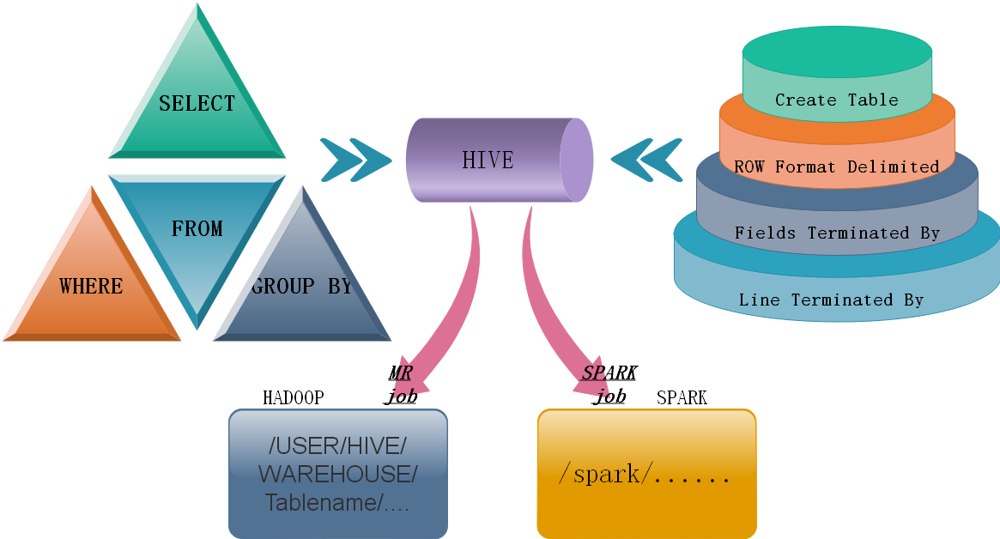

###hive install & use

1.1 mysql安装：  


* 上传mysql安装包  
* 解压：tar -xvf MySQL-5.6.26-1.linux_glibc2.5.x86_64.rpm-bundle.tar   
* 安装mysql的server包,rpm -ivh MySQL-server-5.6.26-1.linux_glibc2.5.x86_64.rpm   
* 依赖报错：缺perl,yum install perl,安装完perl后 ，继续重新安装mysql-server

```
[root@mylove ~]# rpm -ivh MySQL-server-5.6.26-1.linux_glibc2.5.x86_64.rpm   
又出错：包冲突conflict with  
移除老版本的冲突包：mysql-libs-5.1.73-3.el6_5.x86_64
[root@mylove ~]# rpm -e mysql-libs-5.1.73-3.el6_5.x86_64 --nodeps  
   
继续重新安装mysql-server  
[root@mylove ~]# rpm -ivh MySQL-server-5.6.26-1.linux_glibc2.5.x86_64.rpm   

成功后，注意提示：里面有初始密码及如何改密码的信息  
初始密码：/root/.mysql_secret    
改密码脚本：/usr/bin/mysql_secure_installation  

安装mysql的客户端包：  
[root@mylove ~]# rpm -ivh MySQL-client-5.6.26-1.linux_glibc2.5.x86_64.rpm  

启动mysql的服务端：  
[root@mylove ~]# service mysql start  
Starting MySQL. SUCCESS!  
 

修改root的初始密码：  
[root@mylove ~]# /usr/bin/mysql_secure_installation  按提示  

测试：  
用mysql命令行客户端登陆mysql服务器看能否成功  
[root@mylove ~]# mysql -uroot -proot  
mysql> show databases;  
```

1.2  hive的元数据库配置

* vi conf/hive-site.xml:

```
<configuration>
<property>
<name>javax.jdo.option.ConnectionURL</name>
<value>jdbc:mysql://localhost:3306/hive?createDatabaseIfNotExist=true</value>
<description>JDBC connect string for a JDBC metastore</description>
</property>

<property>
<name>javax.jdo.option.ConnectionDriverName</name>
<value>com.mysql.jdbc.Driver</value>
<description>Driver class name for a JDBC metastore</description>
</property>

<property>
<name>javax.jdo.option.ConnectionUserName</name>
<value>root</value>
<description>username to use against metastore database</description>
</property>

<property>
<name>javax.jdo.option.ConnectionPassword</name>
<value>root</value>
<description>password to use against metastore database</description>
</property>
</configuration>
```

* 上传一个mysql的驱动jar包到hive的安装目录的lib中  
* 配置HADOOP_HOME 和HIVE_HOME到系统环境变量中：/etc/profile  
* source /etc/profile,hive启动测试


1.3 hive的操作：

外部表(EXTERNAL_TABLE)：表目录由建表用户自己指定 

```
create external table t_access(ip string,url string,access_time string)  
row format delimited  
fields terminated by ','  
location '/access/log';  
```

*外部表和内部表的特性差别：  
1、内部表的目录在hive的仓库目录中 VS 外部表的目录由用户指定  
2、drop一个内部表时：hive会清除相关元数据，并删除表数据目录  
3、drop一个外部表时：hive只会清除相关元数据*

带分区的表
```
create table t_access(ip string,url string,access_time string)
partitioned by(dt string)
row format delimited
fields terminated by ',';
```


1.4 hive基本思想：  
Hive是基于Hadoop的一个数据仓库工具(离线)，可以将结构化的数据文件映射为一张数据库表，并提供类SQL查询功能。



* hive特点：   

可扩展   
Hive可以自由的扩展集群的规模，一般情况下不需要重启服务。  

延展性   
Hive支持用户自定义函数，用户可以根据自己的需求来实现自己的函数。  
 
容错   
良好的容错性，节点出现问题SQL仍可完成执行。  


* hive 操作案例

1.1 

```sql
create table t_101(name String,number int)     
row formate delimited     
fields terminated by ',';  
```
数据如下:  
a,1  
b,1  
c,1  

```sql
create table t_102(name String,number int)     
row formate delimited     
fields terminated by ',';  
```
数据如下:  
a,21  
b,11  
c,31  

要求：将/root/t1.sh,t2.sh分别放入这两个表中，实现内连接，左连接，全外连接
```sql
load data local inpath '/root/t1.sh' into table t_101;
load data local inpath '/root/t2.sh' into table t_102;

内连接  
select a.*, b.* from t_101 a join t_102 b;  
内连接为笛卡尔积，左边一个连对面所有；  
 左连接  
select a.*, b.* from t_101 a left join t_102 b on a.name = b.name;  
全外连接  
select a.*, b.* from t_101 a full outer join t_102 b on a.name = b.name;  
```
  
  
1.2

(聚合与分组) 

```sql
create table t_103(ip String,url String,time String)     
row formate delimited     
fields terminated by ',';  
```
数据如下：  
192.163.33.4,http://sina.com/f,2017-09-17  
192.163.33.2,http://sina.com/b,2017-09-13  
192.163.33.6,http://sina.com/h,2017-09-19  
192.163.33.9,http://sina.com/c,2017-09-15  
192.163.33.0,http://sina.com/s,2017-09-13  
192.163.33.2,http://sina.com/f,2017-09-13  
192.163.33.4,http://sina.com/g,2017-09-14  
192.163.33.8,http://sina.com/p,2017-09-15  
192.163.32.1,http://sina.com/p,2017-09-16  
192.163.31.0,http://sina.com/i,2017-09-17  
192.163.36.7,http://sina.com/fv2017-09-18  
192.163.32.2,http://sina.com/b,2017-09-19  
192.163.34.6,http://sina.com/n,2017-09-11   
192.163.36.6,http://sina.com/m,2017-09-12  
```
load data local inpath '/root/t1.sh' into table t_103;
```
要求：1，求出ip，url（转为大写）；2，统计url的数量；3，求出每个url个数以及ip最大的；4，求每个用户ip访问的数量，访问页面以及数量以及时间最晚的。  

```sql
select ip,upper(url) from t_103;
select url,count(1) as counts from t_103 group by url;
select url,max(ip) from t_103 group by url;
seelect ip,count(1) as count_ip,url,count(1) s count_url,max(time) from t_103 group by ip,url;
```
