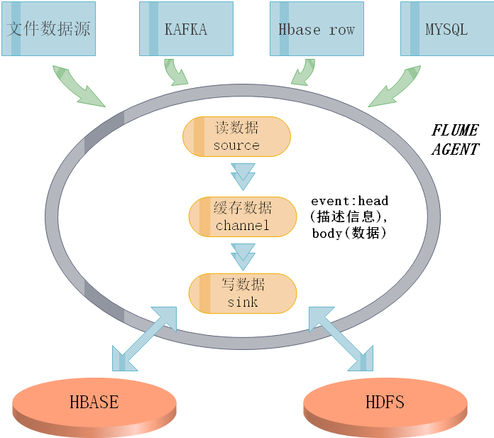

###flume

1. Flume是Cloudera提供的一个高可用的，高可靠的，分布式的海量日志采集、聚合和传输的系统，Flume支持在日志系统中定制各类数据发送方，用于收集数据；同时，Flume提供对数据进行简单处理，并写到各种数据接受方（可定制）的能力。Flume提供了从console（控制台）、RPC（Thrift-RPC）、text（文件）、tail（UNIX tail）、syslog（syslog日志系统），支持TCP和UDP等2种模式），exec（命令执行）等数据源上收集数据的能力。

2. Flume-og采用了多Master的方式。为了保证配置数据的一致性，Flume引入了ZooKeeper，用于保存配置数据，ZooKeeper本身可保证配置数据的一致性和高可用，另外，在配置数据发生变化时，ZooKeeper可以通知Flume Master节点。Flume Master间使用gossip协议同步数据。Flume-ng最明显的改动就是取消了集中管理配置的 Master 和 Zookeeper，变为一个纯粹的传输工具。Flume-ng另一个主要的不同点是读入数据和写出数据现在由不同的工作线程处理（称为 Runner）。 在 Flume-og 中，读入线程同样做写出工作（除了故障重试）。如果写出慢的话（不是完全失败），它将阻塞 Flume 接收数据的能力。这种异步的设计使读入线程可以顺畅的工作而无需关注下游的任何问题。

3. Agent主要由:source,channel,sink三个组件组成.  
Source:  
从数据发生器接收数据,并将接收的数据以Flume的event格式传递给一个或者多个通道channel,Flume提供多种数据接收的方式,比如Avro,Thrift,twitter1%等  
Channel:  
channel是一种短暂的存储容器,它将从source处接收到的event格式的数据缓存起来,直到它们被sinks消费掉,它在source和sink间起着桥梁的作用,channel是一个完整的事务,这一点保证了数据在收发的时候的一致性. 并且它可以和任意数量的source和sink链接. 支持的类型有: JDBC channel , File System channel , Memort channel等.  
sink:  
sink将数据存储到集中存储器比如Hbase和HDFS,它从channals消费数据(events)并将其传递给目标地. 目标地可能是另一个sink,也可能HDFS,HBase.  

如图所示  


**flume将本地磁盘/root/log/下的日志数据写入hdfs里:**

```bash
#启动命令bin/flume-ng agent -c conf -f conf/dir-hdfs.conf -n ag1
ag1.sources = source1
ag1.sinks = sink1
ag1.channels = channel1

# 配置source组件
ag1.sources.source1.type = spooldir
ag1.sources.source1.spoolDir = /root/log/
ag1.sources.source1.fileSuffix=.FINISHED
ag1.sources.source1.deserializer.maxLineLength=5120

# 配置sink组件
ag1.sinks.sink1.type = hdfs
ag1.sinks.sink1.hdfs.path =hdfs://node1:9000/access_log/%y-%m-%d/%H-%M
ag1.sinks.sink1.hdfs.filePrefix = app_log
ag1.sinks.sink1.hdfs.fileSuffix = .log
ag1.sinks.sink1.hdfs.batchSize= 100
ag1.sinks.sink1.hdfs.fileType = DataStream
ag1.sinks.sink1.hdfs.writeFormat =Text

## roll：滚动切换：控制写文件的切换规则
ag1.sinks.sink1.hdfs.rollSize = 512000    ## 按文件体积（字节）来切   
ag1.sinks.sink1.hdfs.rollCount = 1000000  ## 按event条数切
ag1.sinks.sink1.hdfs.rollInterval = 60    ## 按时间间隔切换文件

## 控制生成目录的规则
ag1.sinks.sink1.hdfs.round = true
ag1.sinks.sink1.hdfs.roundValue = 10
ag1.sinks.sink1.hdfs.roundUnit = minute

ag1.sinks.sink1.hdfs.useLocalTimeStamp = true

# channel组件配置
ag1.channels.channel1.type = memory
ag1.channels.channel1.capacity = 500000   ## event条数
ag1.channels.channel1.transactionCapacity = 600  ##flume事务控制所需要的缓存容量600条event

# 绑定source、channel和sink之间的连接
ag1.sources.source1.channels = channel1
ag1.sinks.sink1.channel = channel1
```


**flume将本地磁盘/root/log/下的动态数据写入hdfs里:**

```bash
tail-hdfs.conf

用tail命令获取数据，下沉到hdfs
启动命令：
bin/flume-ng agent -c conf -f conf/tail-hdfs.conf -n a1
########

# Name the components on this agent
a1.sources = r1
a1.sinks = k1
a1.channels = c1

# Describe/configure the source
a1.sources.r1.type = exec
a1.sources.r1.command = tail -F /root/app_weichat_login.log

# Describe the sink
agent1.sinks.sink1.type = hdfs
agent1.sinks.sink1.hdfs.path =hdfs://hdp20-01:9000/app_weichat_login_log/%y-%m-%d/%H-%M
agent1.sinks.sink1.hdfs.filePrefix = weichat_log
agent1.sinks.sink1.hdfs.fileSuffix = .dat
agent1.sinks.sink1.hdfs.batchSize= 100
agent1.sinks.sink1.hdfs.fileType = DataStream
agent1.sinks.sink1.hdfs.writeFormat =Text

agent1.sinks.sink1.hdfs.rollSize = 100
agent1.sinks.sink1.hdfs.rollCount = 1000000
agent1.sinks.sink1.hdfs.rollInterval = 60

agent1.sinks.sink1.hdfs.round = true
agent1.sinks.sink1.hdfs.roundValue = 1
agent1.sinks.sink1.hdfs.roundUnit = minute


agent1.sinks.sink1.hdfs.useLocalTimeStamp = true


# Use a channel which buffers events in memory
a1.channels.c1.type = memory
a1.channels.c1.capacity = 1000
a1.channels.c1.transactionCapacity = 100

# Bind the source and sink to the channel
a1.sources.r1.channels = c1
a1.sinks.k1.channel = c1
```

**flume将本地磁盘/root/log/下的动态数据写入一个缓存文件avo中，再让另外一个flume读取avo中数据写入hdfs里:**

```bash
从tail命令获取数据发送到avro端口
另一个节点可配置一个avro源来中继数据，发送外部存储


##################
# Name the components on this agent
a1.sources = r1
a1.sinks = k1
a1.channels = c1

# Describe/configure the source
a1.sources.r1.type = exec
a1.sources.r1.command = tail -F /root/log/access.log


# Describe the sink
a1.sinks.k1.type = avro
a1.sinks.k1.hostname = hdp-05
a1.sinks.k1.port = 4141
a1.sinks.k1.batch-size = 2


# Use a channel which buffers events in memory
a1.channels.c1.type = memory
a1.channels.c1.capacity = 1000
a1.channels.c1.transactionCapacity = 100

# Bind the source and sink to the channel
a1.sources.r1.channels = c1
a1.sinks.k1.channel = c1


--------------------------------------------------------------------------------------


从avro端口接收数据，下沉到hdfs

#####
bin/flume-ng agent -c conf -f avro-hdfs.conf -n a1 -Dflume.root.logger=INFO,console


采集配置文件，avro-hdfs.conf

# Name the components on this agent
a1.sources = r1
a1.sinks = k1
a1.channels = c1

# Describe/configure the source
##source中的avro组件是一个接收者服务
a1.sources.r1.type = avro
a1.sources.r1.bind = slave3
a1.sources.r1.port = 4141


# Describe the sink
a1.sinks.k1.type = hdfs
a1.sinks.k1.hdfs.path = /flume/taildata/%y-%m-%d/
a1.sinks.k1.hdfs.filePrefix = tail-
a1.sinks.k1.hdfs.round = true
a1.sinks.k1.hdfs.roundValue = 24
a1.sinks.k1.hdfs.roundUnit = hour
a1.sinks.k1.hdfs.rollInterval = 0
a1.sinks.k1.hdfs.rollSize = 0
a1.sinks.k1.hdfs.rollCount = 50
a1.sinks.k1.hdfs.batchSize = 10
a1.sinks.k1.hdfs.useLocalTimeStamp = true
#生成的文件类型，默认是Sequencefile，可用DataStream，则为普通文本
a1.sinks.k1.hdfs.fileType = DataStream

# Use a channel which buffers events in memory
a1.channels.c1.type = memory
a1.channels.c1.capacity = 1000
a1.channels.c1.transactionCapacity = 100

# Bind the source and sink to the channel
a1.sources.r1.channels = c1
a1.sinks.k1.channel = c1


发送数据：
$ bin/flume-ng avro-client -H localhost -p 4141 -F /usr/logs/log.10
```
