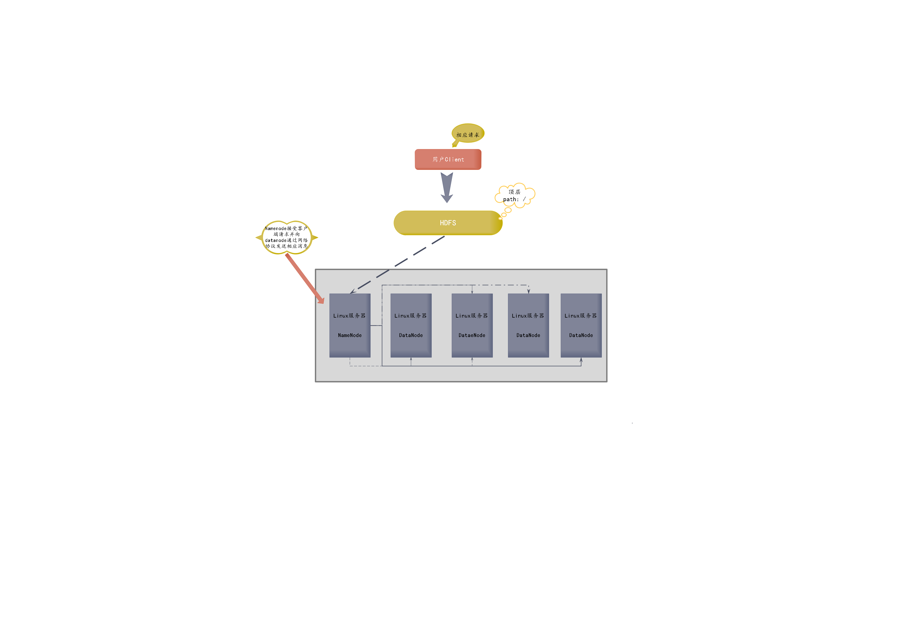

###Welcome to use Hadoop

1.1 大数据者，海量数据之存储者也:  
  存储框架:  
  * HDFS -- 分布式文件存储系统  
  * HBASE -- 分布式数据库系统  
  * KAFKA -- 分布式消息缓存系统  
  * YARN -- 分布式资源调度平台  
  

  运算框架：  
  * MAPREDUCE -- 离线批处理  
  * SPARK -- 离线批处理|实时流式计算  
  * STORM --  实时流式计算  

辅助工具：  
  * FLUME -- 数据采集  
  * SQOOP -- 数据迁移  
  * HIVE -- 数据仓库，将SQL语句翻译为MapReduce运行计算
  * ELASTICSEARCH -- 分布式搜索引擎
  

1.2 什么是Hadoop:
hadoop由3个核心组件组成：  
* 分布式文件系统 -- HDFS  
* 分布式运算框架 -- MapReduce  
* 分布式资源调度平台 -- YARN  

1.3 hdfs运行机制

* hdfs有着文件系统类似的结构：  
1.  有目录结构，顶层目录为/  
2. 系统存放的就是文件  
3. 系统可以提供对文件的创建、删除、修改、查看、移动等功能

* hdfs与普通操作系统的区别：
1. 单机文件系统中存放的文件，是在一台机器的操作系统中  
2. dfs的文件系统会横跨N多的机器  
3. 单机文件系统中存放的文件，是在一台机器的磁盘上  
4. hdfs文件系统中存放的文件，是落在n多机器的本地单机文件系统中（hdfs是一个基于linux本地文件系统之上的文件系统）

* hdfs的工作机制：
1. 客户把一个文件存入hdfs系统中，活动方式会把这个文件切分成多个块后，分布存储在N个服务器上(datanode)  
2. 当多个block块存在多台datanode上时，需要一台机器记录存放规则信息(namenode)  
3. 为了防止分散的块丢失，需要将每一个block指定n个副本存放在datanode上
