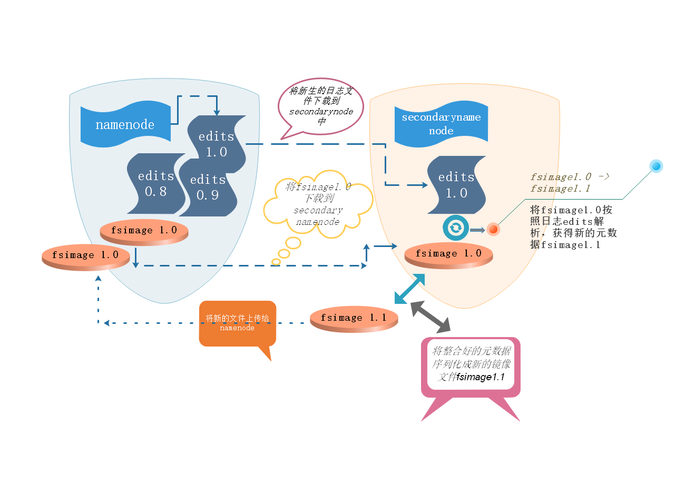
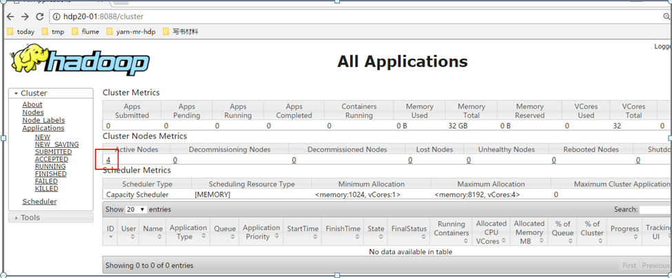

###HDFS 核心工作原理namenode元数据管理要点  


**namenode元数据管理**  

1、hdfs的目录结构及每一个文件的块信息(块的id，块的副本数量，块的存放位置<datanode>)就是元数据

2、元数据由namenode负责管理   


3、namenode把元数据记录在:      
* namenode的实时的完整的元数据存储在内存中；  
* namenode还会在磁盘中（dfs.namenode.name.dir）存储内存元数据在某个时间点上的镜像文件；  
* namenode会把引起元数据变化的客户端操作记录在edits日志文件中；  
* secondarynamenode会定期从namenode上下载fsimage镜像和新生成的edits日志，然后加载fsimage镜像到内存中，然后顺序解析edits文件，对内存中的元数据对象进行修改(整合),整合完成后，将内存元数据序列化成一个新的fsimage，并将这个fsimage镜像文件上传给namenode  
* 上述过程叫做：checkpoint操作，第一次secondarynamenode需要从namenode中下载fsimage文件，以后就不用了，只需析edits即可  


4、原理如下图所示  
  


**安装yarn集群**  

mapreduce程序应该是在很多机器上并行启动，而且先执行map task，当众多的maptask都处理完自己的数据后，还需要启动众多的reduce task，这个过  程如果用用户自己手动调度不太现实，需要一个自动化的调度平台——hadoop中就为运行mapreduce之类的分布式运算程序开发了一个自动化调度平台——YARN

---

yarn集群中有两个角色：  	
主节点：Resource Manager  1台  
从节点：Node Manager   N台  
Resource Manager一般安装在一台专门的机器上，Node Manager应该与HDFS中的data node重叠在一起  


---


修改配置文件：vi yarn-site.xml：  

```
<property>
<name>yarn.resourcemanager.hostname</name>
<value>node1</value>
</property>

<property>
<name>yarn.nodemanager.aux-services</name>
<value>mapreduce_shuffle</value>
</property>

<property>
<name>yarn.nodemanager.resource.memory-mb</name>
<value>2048</value>
</property>

<property>
<name>yarn.nodemanager.resource.cpu-vcores</name>
<value>2</value>
</property>
```


---

然后复制到每一台机器上,然后，就可以用脚本启动yarn集群：sbin/start-yarn.sh. 停止：sbin/stop-yarn.sh   
4、用jps检查yarn的进程，用web浏览器查看yarn的web控制台http://hdp20-01:8088  


 


