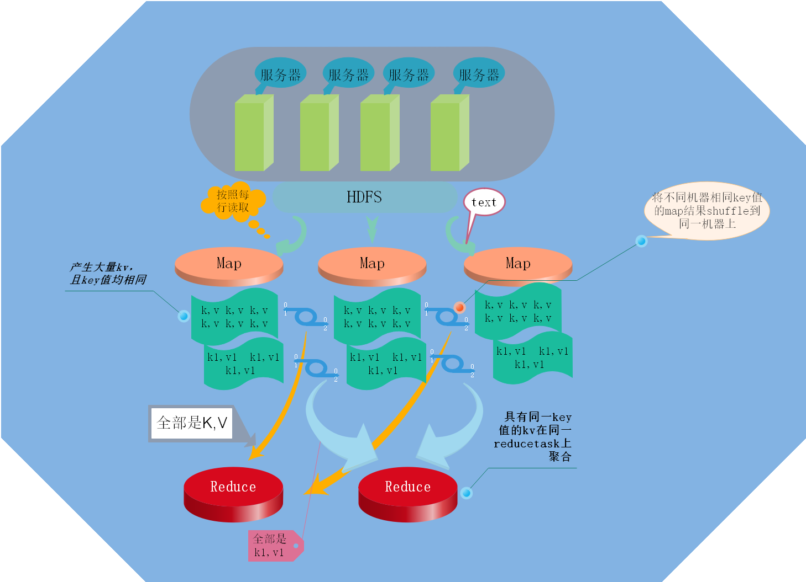
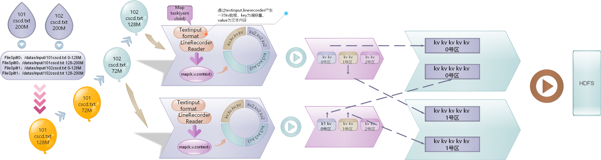

###Mapreduce工作原理

* 分布式计算原理：
  * map阶段：将hdfs中的block(128M)分给maptask，maptask按照每一行读取文本，将每一行文本按相关规则切割，形成 一组(key => value)的数据  
  * reuduce阶段：定义reducetask个数，将maptask产生的数据，kv值，按照key值相等的kv分配给同一个reduce运算，当同一key在不同的机器上时，需要shuffle通过网络将不同机器上的同一kv值传递给同一reducetask，而后reducetask将具有相同key值的kv按一定规则聚合，最后写入磁盘。  
  * 任务调度(Yran):集群中有唯一resoucemanager，很多台nodemanager，yarn负责调度管理资源。
  
 * mapreduce工作示意图如下：   
 
 
  
  * mapreduce框架内部核心工作原理：
  
---
 1. *对于hdfs上的文件，maptask在读取时按照文件描述信息:文件路径，偏移量范围来分区；当maptask读取的问文件来自数据库时，按照库名，表名，行范围划分区。2. 对于这些文件，负责划分切片任务由job客户端完成：扫描每一个文件，按照128M划分范围，按以上规则分区。此时yarn会开启多个yarnchild管理maptask，maptask负责对扫描到的文件按照每一行读取，调用TextInputformat读取内容，并且调用LineRecordReader()记录偏移量，产生一对kv数据，key为偏移量，value为一行文本内容Text，为map(LongWritable, Text, Context)。3. maptask按照一定规则切割text，再按照一定规则将其放入context中，写入mapoutputcollector所在的磁盘缓冲区，磁盘里保存的全是同样的kv数据。缓冲区为环形，每一段保存相同kv数据。通过combiner将不同机器同样kv的数据局部和，merge合并分区在不同机器磁盘上，记录分区索引。4. 然后yarn开启多个yarnchild管理redcuetask，读取磁盘上的数据，按照索引将不同区同样kv的数据按照规则聚合，最终写入hdfs文件系统里。*
 ---

