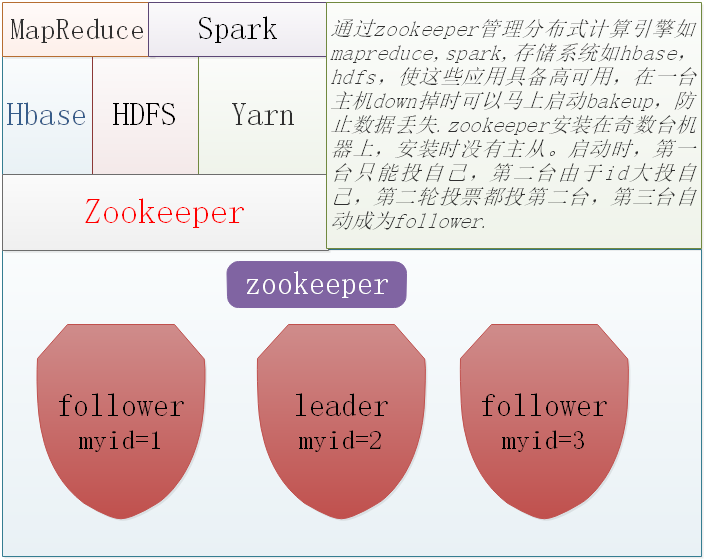

###zookeeper

* zookeeper集群搭建：  

1. 上传安装包到集群服务器
2. 解压  
3. 修改配置文件 ： 
进入zookeeperd的安装目录文件conf目录，vi zoo.cfg:  

```
# The number of milliseconds of each tick
tickTime=2000
initLimit=10
syncLimit=5
dataDir=/root/zkdata
clientPort=2181

#autopurge.purgeInterval=1
server.1=hdp20-01:2888:3888
server.2=hdp20-02:2888:3888
server.3=hdp20-03:2888:3888
```

* 对3台节点，都创建目录 mkdir /root/zkdata  
* 对3台节点，在工作目录中生成myid文件，但内容要分别为各自的id： 1,2,3  
hdp20-01上：  echo 1 > /root/zkdata/myid  
hdp20-02上：  echo 2 > /root/zkdata/myid  
hdp20-03上：  echo 3 > /root/zkdata/myid  
* 安装目录到其他两个节点
* 启动zookeeper集群
* zookeeper没有提供自动批量启动脚本，需要手动一台一台地起zookeeper进程,在每一台节点上，运行命令:  
bin/zkServer.sh start,启动后，用jps应该能看到一个进程：QuorumPeerMain  


###zookeeper应用的基本场景及基本功能




###zookeeper的数据存储机制

1. zookeeper中对用户的数据采用kv形式存储  
  1. key：是以路径的形式表示的，那就以为着，各key之间有父子关系，比如/ 是顶层key  
  2. 用户建的key只能在/ 下作为子节点，比如建一个key： /aa  这个key可以带value数据 也可以建一个key： /bb
  3. zookeeper中，对每一个数据key，称作一个znode
  
  
2. zookeeper中的znode有多种类型：  
*PERSISTENT  持久的：创建者就算跟集群断开联系，该类节点也会持久存在与zk集群中*  
*EPHEMERAL  短暂的：创建者一旦跟集群断开联系，zk就会将这个节点删除*    
*SEQUENTIAL  带序号的：这类节点，zk会自动拼接上一个序号，而且序号是递增的*  


  